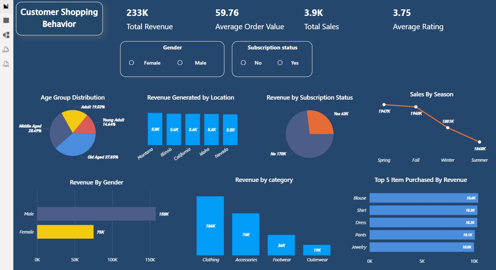

# 🛍️ Customer Shopping Behavior Analysis

📊 **End-to-End Data Analytics Project | Python • SQL • Power BI**

---

## 🚀 Project Overview
This project analyzes **customer shopping behavior** using Python, SQL, and Power BI.  
It covers the complete analytics pipeline — from **data cleaning and transformation** to **SQL-driven insights** and **interactive dashboard visualization**.

---

## 📁 Dataset Snapshot
- 📦 **Records:** 3,900 customers  
- 🧾 **Features:** 18 columns  
- 💰 **Total Revenue:** ~233K  
- 🛒 **Total Sales:** ~3.9K  
- ⭐ **Average Rating:** ~3.75  
- 🧮 **Average Order Value:** ~59.76  

---

## 🧱 Tech Stack
| Layer | Tools |
|-----|------|
| Data Cleaning | Pandas, NumPy |
| Visualization | Matplotlib, Seaborn |
| Database | MySQL |
| Data Transfer | SQLAlchemy |
| BI Dashboard | Power BI |

---

## 🔍 Data Understanding
- Loaded dataset using `pandas.read_csv`
- Reviewed schema, data types, and memory usage
- Generated summary statistics
- Identified missing values in `review_rating`

---

## 🧹 Data Cleaning & Preparation
✔ Filled missing review ratings using **category-wise median**  
✔ Standardized column names (snake_case)  
✔ Removed duplicate information between discount columns  
✔ Verified **zero duplicates** in the dataset  

---

## 🧠 Feature Engineering
✨ Created meaningful customer segments:
- **Age Groups**
  - Young Adult
  - Adult
  - Middle Aged
  - Old Aged
- Converted purchase frequency into numeric days
- Renamed and optimized key columns for analysis

---

## 🗄️ Database Integration
- Connected Python to MySQL using SQLAlchemy
- Stored cleaned data into MySQL tables
- Enhanced table with purchase frequency in days
- Verified data integrity via SQL queries

---

## 🧮 SQL Business Questions Answered
✔ Customer distribution by age group  
✔ Revenue contribution by gender  
✔ Most purchased items & top categories  
✔ Seasonal revenue trends  
✔ Popular sizes, colors, and locations  
✔ Subscriber vs non-subscriber behavior  
✔ High-value locations and champion customers  
✔ Revenue leaders per category  

---

## 📌 Key Insights
### 💰 Revenue & Sales
- Total revenue of **~233K** generated from **3.9K purchases**
- **Clothing** is the top revenue-generating category
- **Blouse, Shirt, Dress, Pants, Jewelry** drive the highest sales

### 👥 Customer Behavior
- **Middle Aged** and **Old Aged** customers form the largest buying groups
- Male customers generate higher overall revenue
- Non-subscribers contribute more revenue, while subscribers show repeat behavior

### 📆 Seasonality
- **Spring and Fall** show peak sales
- **Summer** records the lowest revenue

### ⭐ Customer Experience
- Average customer rating is **~3.75**
- Shipping type impacts review ratings
- Discounted purchases maintain strong ratings

---

## 📊 Power BI Dashboard
An interactive Power BI dashboard was created to visualize:
- Revenue KPIs
- Category and product performance
- Subscription impact
- Seasonal sales trends
- Customer demographics

### 🔍 Dashboard Preview

---

## 🧠 What This Project Demonstrates
✔ Strong EDA and data cleaning skills  
✔ SQL analytics using CTEs & window functions  
✔ Business-focused data storytelling  
✔ End-to-end analytics workflow  
✔ Dashboard-driven insights for stakeholders  

---

## ✅ Conclusion
This project showcases a complete **data analytics lifecycle**, combining Python, SQL, and Power BI to extract actionable insights from customer shopping data.
